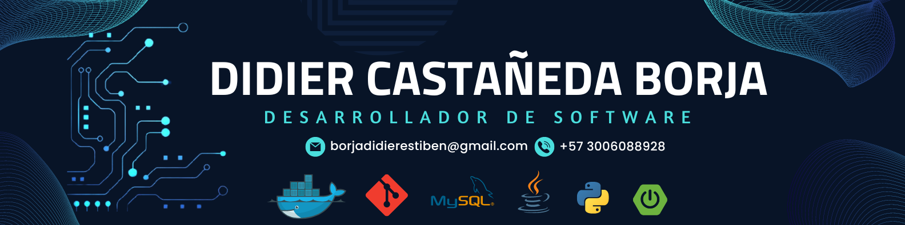

<h1>
 Bienvenid@ a mi GitHub
</h1>

 Soy Didier Castañeda Borja, tecnólogo en análisis y desarrollo de software con experiencia como desarrollador. He trabajado en proyectos utilizando Java, Spring Boot, JavaScript, React.js, Next.js, Python y MySql. Me apasionan los retos poder aprender e innovar cada dia, siempre busco aprender nuevas tecnologias, tendencias y poder darles utilidad en mi dia a dia.

## Tecnologías 💻

## 📊 Mis estadísticas de GitHub🚀

 &nbsp;&nbsp;&nbsp;&nbsp;

## 🎶 Lo que estoy escuchando en Spotify

### 

>[!TIP]
>**"Medir el progreso de la programación por líneas de código es como medir el progreso de la construcción de aviones por el peso".**
> – *Bill Gates*

